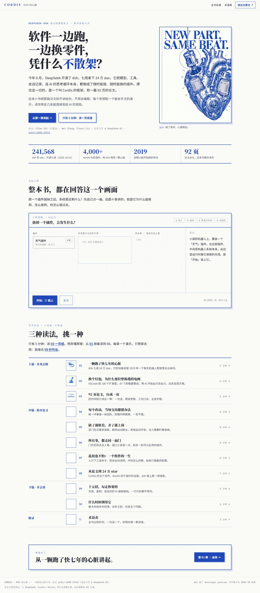
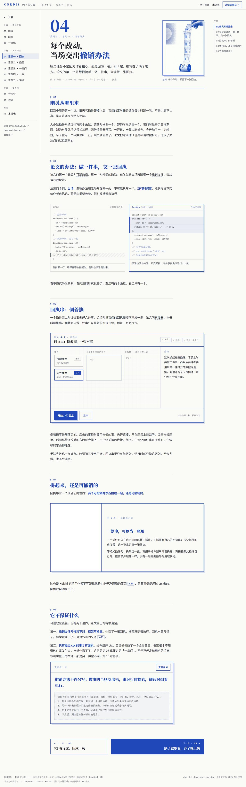

# 3011 · DSH 论文笔记

把 DeepSeek 的 Cordis 论文（arXiv:2608.25512《A Programming Paradigm for Spatiotemporal Composability》）和 deepseek-ai/deepseek-harness 仓库研读透，做成一本面向 Vibe Coder 的 12 页交互式网页书。读者不用会编程：每个思想配一个能亲手点的演示，读完带走几条能直接发给 AI 的规矩。

**线上**：https://augustyang.win/cordis/ （Cloudflare Pages 从 main 分支自动构建）

## 目录

| 目录 | 放什么 |
| --- | --- |
| `10-docs/` | 规划文档：PRD、技术方案、各里程碑报告与决策记录 |
| `20-content/` | 内容源：知识库地图（00-MAP.md）、研读总览、7 份素材笔记 |
| `30-site/` | Astro 站点：12 页网页书（落地页 + 十章 + 术语表），文稿即 `src/pages/*.mdx`；本地跑 `cd 30-site && npm run dev` |
| `40-assets/` | 设计资产：2K 插图母本、生图台账、README 用截图（母本不入 git，站点只发布 web 压缩档） |
| `50-design/` | Design Read、色彩配方、OpenDesign 设计稿 |
| `99-archive/` | 归档区：过程稿、评审截图、中间产物（不入 git） |

规则只有三条：根目录只留这份 README 和编号目录，过程文件一律进 `99-archive/`；`40-assets/illustrations/` 与 `99-archive/` 不入 git（见 `.gitignore`）；任何仓库、部署产物与公开分发包不得包含密钥。

仓库为本地 git（`main` 分支），2026-10-03 完成首次快照与目录大整理。

多会话协作领地：`10-docs/01-PRD.md` 的需求变更由主会话（需求讨论）执笔；`10-docs/02-技术方案.md` 归实现侧会话维护；其他文档谁建谁管。任何会话修改共享文件（README、里程碑）前，先重读最新版再动笔。

## 当前进度

- 2026-10-01：研读完成，1 份总览 + 7 份素材落盘（`20-content/`）
- 2026-10-02：目录规划定稿，PRD 草稿 v0.1（`10-docs/01-PRD.md`）
- 2026-10-02：动效与前端技术选型定稿，技术基准文档 `10-docs/02-技术方案.md` 成文
- 2026-10-02：PRD 升至 v0.3：多页路由（九页）、站名工作名「DSH 的心脏」、OpenDesign 整站出稿、徽标粒度、性能预算数字等八项拍板
- 2026-10-02：M1 完全闭环（OpenDesign 首页小样通过，hermes + zai:glm-5.3-flash）；五项决策拍板：首页文案 A 组定稿、站名转正「DSH 的心脏」、插图主力 gpt-image-2.5-ext @ 2k、密钥暂不轮换（红线：任何仓库不得含密钥）、域名/开源/英文后置
- 2026-10-02：M2 设计定调完成（四份基准 + 八页视觉稿 8/8 过评，OpenDesign 直驱通道跑通）；技术方案 v0.2、M1 测活报告、M2 定调报告三份文档就绪
- 2026-10-02：M3 内容脚本化完成（九页文稿 9/9 落盘含可靠度徽标，评审收口 4 闭合 + 2 带条件 + 1 未闭合 M3.5 回填）；报告 10-docs/09
- 2026-10-02：M4 骨架与建站完成（Astro 零错误构建、九页 9/9、插图 11/11 重试 0、hero 五拍 CDP 实机验证）；报告 10-docs/12
- 2026-10-02：M4.5 视觉重排完成（四宗罪修复：排版阶梯 v2、卡片回归、拍数引导组件；九页 9/9 过截图评审）；文稿同步为新声音
- 2026-10-03：M4.7 图文与导航升级完成（正文去蓝、翻页器+书页壳、八页嵌 29 张真图 8/8 过评、构建 exit 0）；生图通道双重故障与恢复留痕（M4.7b 补跑）
- 2026-10-03：版心重排（阅读栏左锚 920px 禁居中、七页接右侧「本页目录」轨、卡片等宽归一、沙盒出血公式修正；astro check 0 错）；仓库大整理（2K 母本迁 40-assets、垃圾清理约 190M、git 首次快照）
- 2026-10-04：发布 GitHub 并经 Cloudflare Pages 上线（augustyang.win/cordis/，Worker 路由挂到子路径）；字体自托管（@fontsource，Noto / IBM Plex 均为 OFL 免费协议）；页脚加非官方声明与 AI 插图标识
- 2026-10-04：文稿与网页全面重构（旧 PRD 与技术栈不再约束）：改成 12 页一本书，第 04–08 章与论文五项贡献一一对位；8 个演示从静帧做成能真玩的；比喻收成两条主干（时间 = 回执，空间 = 插座）；可信度改为行内出处小标（悬停出论文原句）；去掉深色模式、ClientRouter、content collections、OG 端点与 GSAP。astro check 0 错、12 页构建通过、`30-site/scripts/probe-ux.mjs` 交互回归全过、390～1920 无横向溢出。计划与诊断见 `99-archive/2026-10-04-重构/PLAN.md`
- 下一步：通读验收 → 上线前定域名与部署
